# Meoware EDU

<p align="center">
  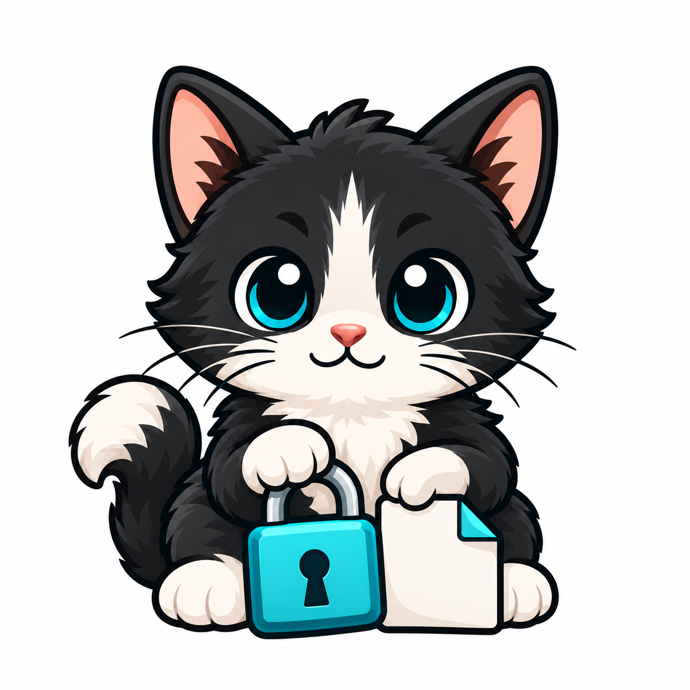
</p>

This PoC based on [malware and cryptography series](https://cocomelonc.github.io/malware/2026/03/05/malware-cryptography-44.html) from my [blog](https://cocomelonc.github.io/)    

Meoware EDU is a standalone C/Win32 ransomware simulation PoC for different cryptographic algorithms. The GUI creates a unique temporary folder with five bundled sample files, encrypts those files with the selected algorithm (AES, TEA, or XTEA), shows a 24-hour countdown, and restores the samples while the session key is in memory. If the countdown expires, the deadline branch removes only the five encrypted sample outputs from that lab.

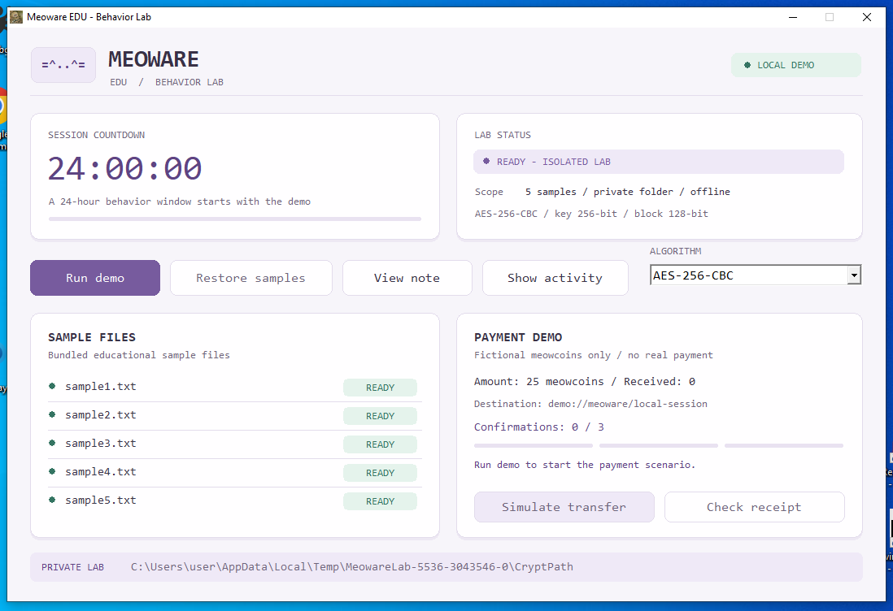    

The lab directory is created under the current user's Windows temporary directory. The application does not accept arbitrary target paths or enumerate drives, register file associations, or touch the registry. Its payment demo uses the Telegram Bot API to exchange a fictional meowcoins request and operator-approved demo receipt; no real payment is requested or verified.

The sample text assets are embedded into the executable at build time. The C implementation separates the Win32 UI, lab workflow, cipher dispatch, and portable TEA, XTEA, CBC, and receipt modules. AES and random key/IV generation use Windows CNG.      

## Algorithms

Choose an algorithm in the `ALGORITHM` list before clicking `Run demo`. AES is the default. The selection locks when the session starts; direct restoration and mock-payment restoration both use that session's cipher and key. Restart the application to try another algorithm in a fresh lab.     

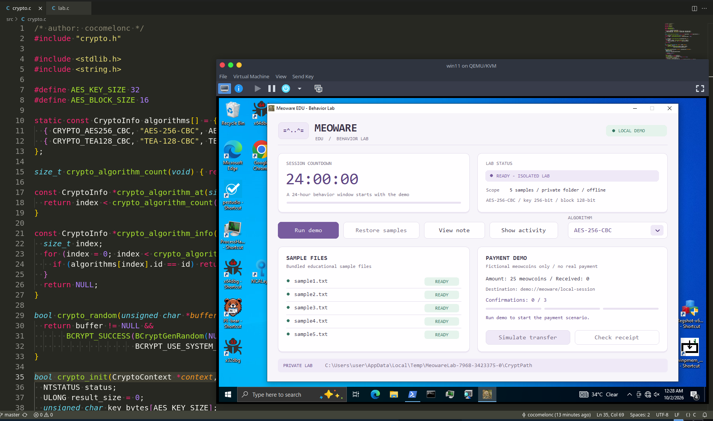    

| GUI option | Key | Block / IV | Implementation |
| --- | --- | --- | --- |
| AES-256-CBC | 256 bits | 128 bits | Windows CNG |
| TEA-128-CBC | 128 bits | 64 bits | Classic TEA, 32 cycles (64 half-rounds), explicit big-endian words: based on [blog](https://cocomelonc.github.io/malware/2023/02/20/malware-av-evasion-12.html) |
| XTEA-128-CBC | 128 bits | 64 bits | Extended TEA, 32 cycles (64 half-rounds), explicit big-endian words: based on [blog](https://cocomelonc.github.io/malware/2023/11/23/malware-cryptography-22.html) |
| RC5-128-CBC | 128 bits | 64 bits | RC5-32/12/16, 12 rounds, explicit little-endian words: [blog](https://cocomelonc.github.io/malware/2023/08/13/malware-cryptography-1.html)|
| RC6-128-CBC | 128 bits | 128 bits | RC6-32/20/16, 20 rounds, explicit little-endian words: [blog](https://cocomelonc.github.io/malware/2024/02/21/malware-cryptography-25.html) |
| A5/1 | 64 bits | Stream / 22-bit COUNT in 3 bytes | Majority-clocked 19/22/23-bit LFSRs; continuous file keystream, no GSM burst framing or padding; educational only ([blog #27](https://cocomelonc.github.io/malware/2024/05/12/malware-cryptography-27.html)) |
| Skipjack-80-CBC | 80 bits | 64 bits | 32 rounds, alternating A/B rules, big-endian words ([blog #20](https://cocomelonc.github.io/malware/2023/08/28/malware-cryptography-20.html)) |
| Camellia-128-CBC | 128 bits | 128 bits | 18 rounds, FL/FLINV layers, big-endian words; RFC 3713 ([blog #38](https://cocomelonc.github.io/malware/2024/12/29/malware-cryptography-38.html)) |
| Speck-128-CBC | 128 bits | 128 bits | Speck128/128, 32 rounds, ARX operations, reference little-endian byte/word order ([blog #42](https://cocomelonc.github.io/malware/2025/05/29/malware-cryptography-42.html)) |

All block cipher modes use `PKCS#7` padding, a fresh random session key, and a fresh IV per sample. TEA and XTEA have separate block implementations and share CBC/padding handling in `src/cbc64.c`. This is a teaching lab: the CBC records do not provide authenticated encryption.      

For TEA: the algorithm selection follows the cryptography series in [my blog](https://cocomelonc.github.io/malware/2023/02/20/malware-av-evasion-12.html). The C snippet in that article uses XTEA-style mixing despite its TEA function names. This implementation follows [Wheeler and Needham's original TEA specification](https://www.cl.cam.ac.uk/ftp/papers/djw-rmn/djw-rmn-tea.html), with known-answer tests from [Crypto++'s TEA vectors](https://github.com/weidai11/cryptopp/blob/master/TestVectors/tea.txt). Other algorithms will be added separately.     

XTEA is the next addition from [Malware and cryptography 22](https://cocomelonc.github.io/malware/2023/11/23/malware-cryptography-22.html). Its implementation follows the 32-cycle construction in [Needham and Wheeler's Tea extensions](https://www.cix.co.uk/~klockstone/xtea.pdf), checked against independent known-answer vectors from [Crypto++](https://github.com/weidai11/cryptopp/blob/master/TestVectors/tea.txt) and [Mbed TLS](https://github.com/Mbed-TLS/mbedtls/blob/mbedtls-2.28.9/library/xtea.c). To try this step, choose `XTEA-128-CBC`, click `Run demo`, then use `Restore samples` or finish the meowcoin payment simulation.

The algorithm catalog in `src/crypto.c` supplies the GUI names, IDs, and sizes. Additional ciphers can extend this catalog and dispatch without changing the payment scenario. New `.meoware` records use a 24-byte header: `MWA2`, a one-byte algorithm ID (`1` = AES, `2` = TEA, `3` = XTEA), a one-byte IV length, two reserved zero bytes, and a 16-byte IV slot (zero-filled after a shorter IV). Ciphertext follows the header. Restoration rejects mismatched cipher IDs or IV lengths, including a TEA/XTEA mismatch despite their identical block sizes. Adding XTEA preserves the existing AES and TEA IDs and the `MWA2` layout. The old `MWA1` format is not read by this version; keys remain in process memory and there is no cross-session restore feature.

## build with MinGW-w64

From this directory:    

```bash
make all
```

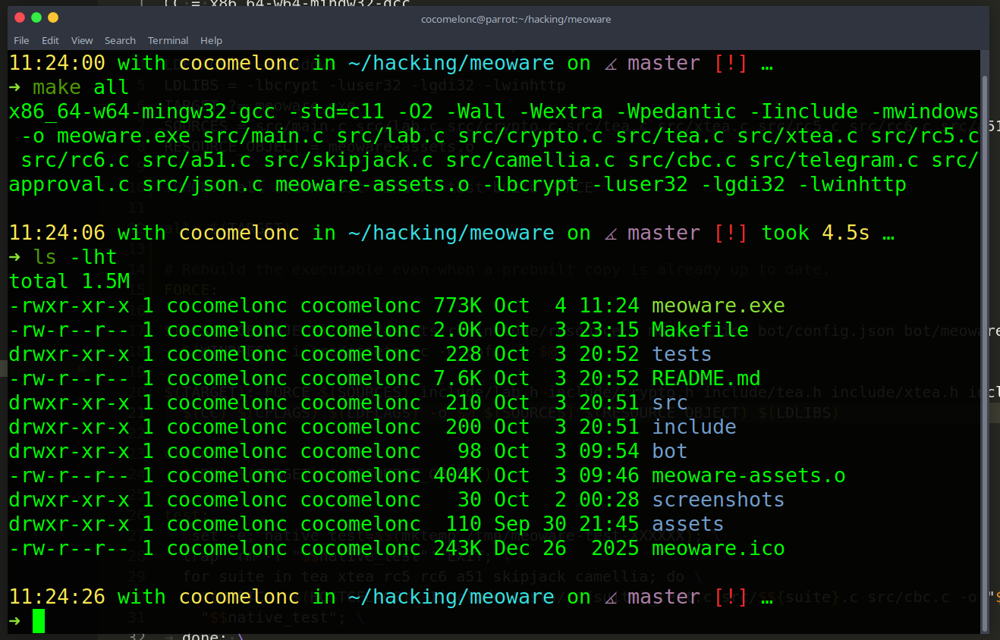    

Or invoke the compiler directly:    

```bash
x86_64-w64-mingw32-windres -i src/assets.rc -O coff -o meoware-assets.o
x86_64-w64-mingw32-gcc -std=c11 -O2 -Wall -Wextra -Wpedantic \
  -Iinclude -mwindows -o meoware.exe \
  src/main.c src/lab.c src/crypto.c src/tea.c src/xtea.c src/cbc64.c \
  src/receipt.c meoware-assets.o \
  -lbcrypt -luser32 -lgdi32
```

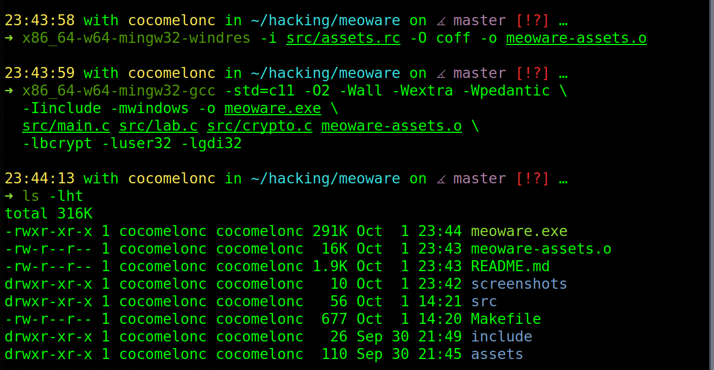     

The build does not require Visual Studio or MFC. The sample assets are packed into `meoware.exe`; no sidecar data directory is required at runtime.    

## Ransomware lab behavior

`Run demo` replaces only the five sample copies inside the unique `CryptPath` folder with `.meoware` outputs. `Restore samples` decrypts them with the key held by the current process. The deadline branch removes only those generated encrypted outputs. The lab directory is left in the temp folder so its contents can be inspected.     

## Payment simulation

The payment flow is a Telegram-mediated demo, with confirmation. The Windows GUI calls Telegram's Bot API directly with WinHTTP. Configure a dedicated test bot and private `chat_id` in `bot/config.json`, then rebuild with `make`; the bot token is embedded in the resulting executable, so use test credentials only. Start the bot chat with `/start` before running the demo.    

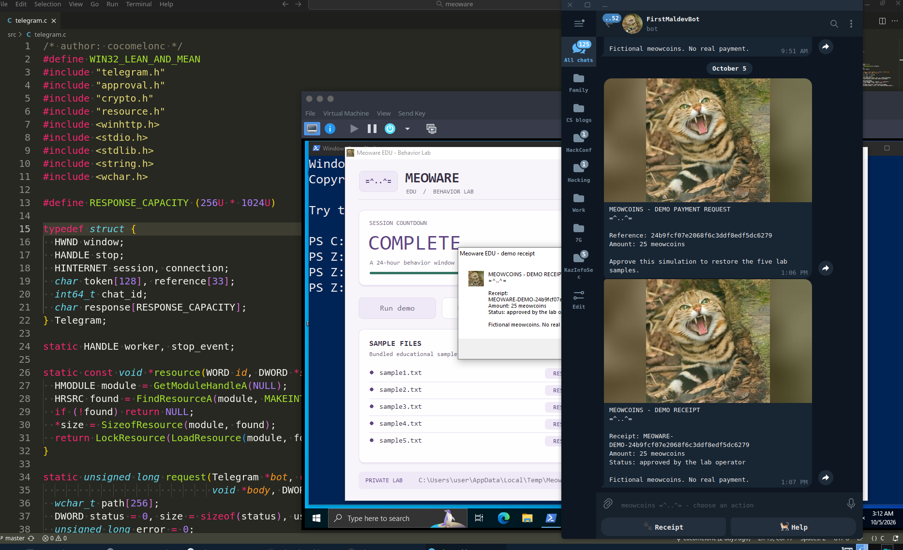    

Click `Run demo`, then `Simulate transfer`. The GUI sends a cat-image payment request for 25 fictional meowcoins to the configured Telegram chat.       

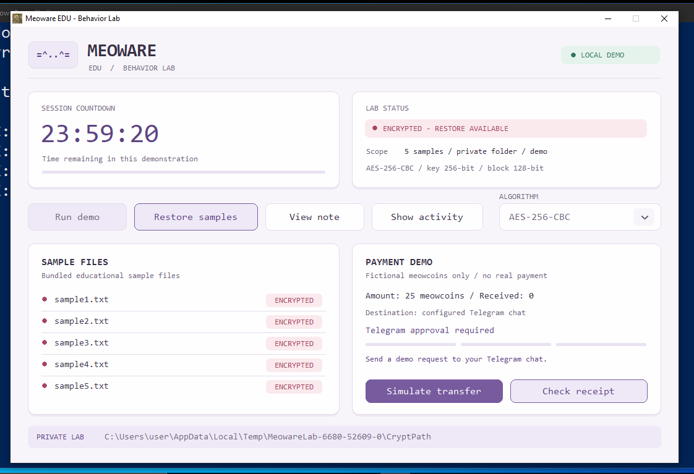    

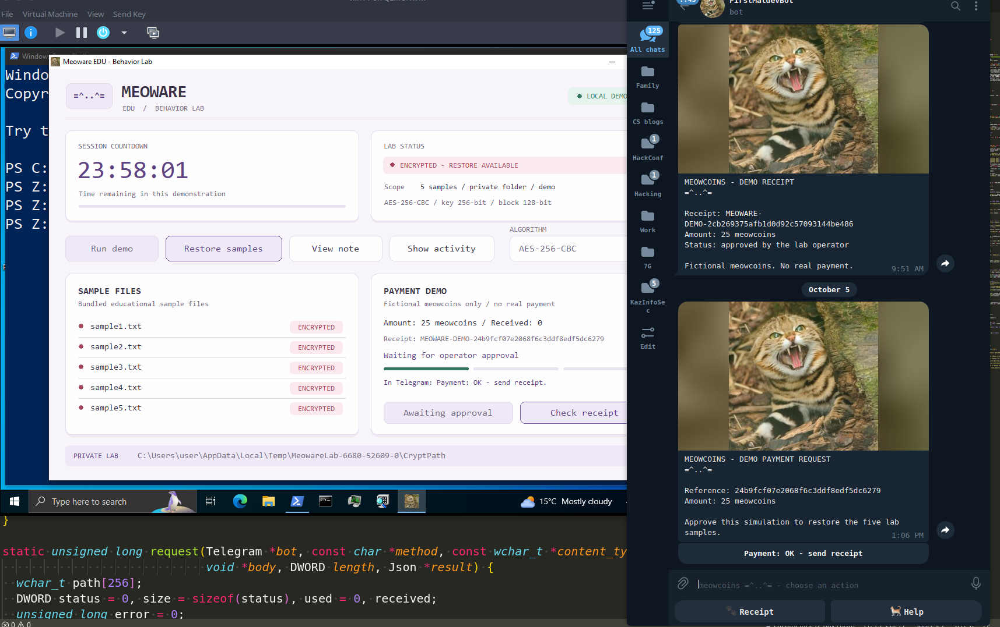    

In that chat, press `Payment: OK - send receipt` on the request. The GUI polls for the callback and checks that it matches the configured chat and current session.    

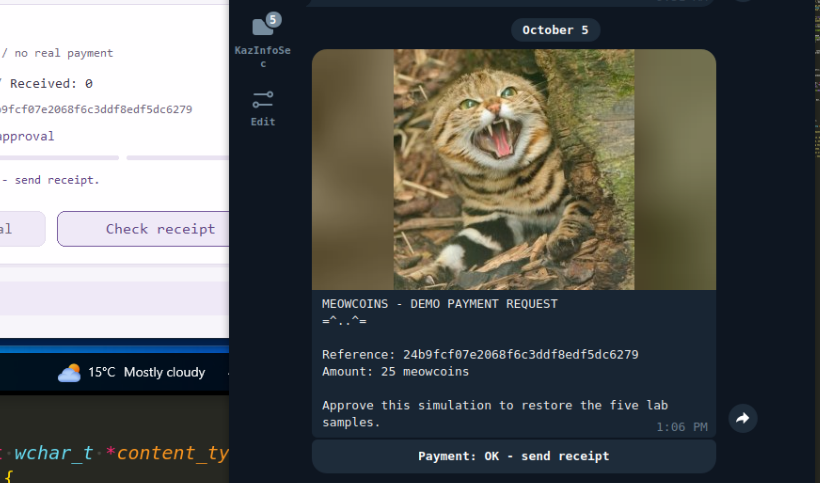    

After approval, the bot sends a demo receipt to the chat and the GUI displays it and restores the five generated samples. `Check receipt` shows the current status; `Retry transfer` is available after a network error, and each retry uses a new session reference.    

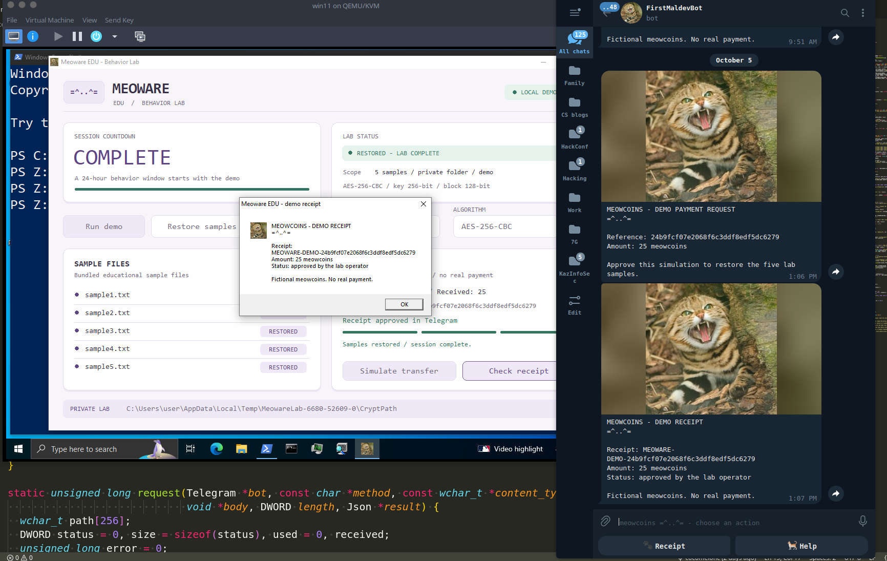    

The GUI is the only update consumer for this bot token: stop other polling clients and do not configure a webhook for it. An existing webhook or competing poller prevents the approval flow from working. No real money, wallet, or blockchain is involved; the amount and receipt are fictional. The request sends only the demo amount, a random session reference, and fixed demo text, not encryption keys, sample contents, paths, or machine information. `Restore samples` remains available for local recovery regardless of Telegram status.

Run the portable receipt, TEA, and XTEA tests with a host C compiler (no Windows or Wine needed). These cover published cipher vectors, CBC chaining, padding rejection, buffer boundaries, in-place operations, and exact restoration of the five bundled samples:

```bash
make test
```

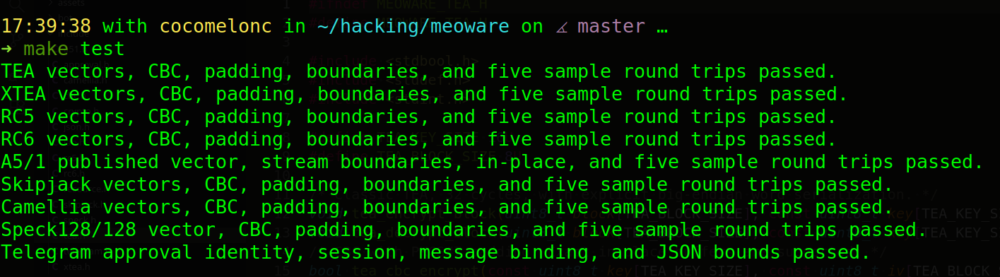    

Build the Windows integration tests with `make windows-test-build`. Run the resulting `/tmp/meoware-lab-tests.exe` on Windows or under Wine to check AES, TEA, and XTEA through the actual lab workflow, including cipher dispatch, header validation, restoration against embedded resources, and the deadline branch. The tests create their own temporary labs and remove them after successful checks.
